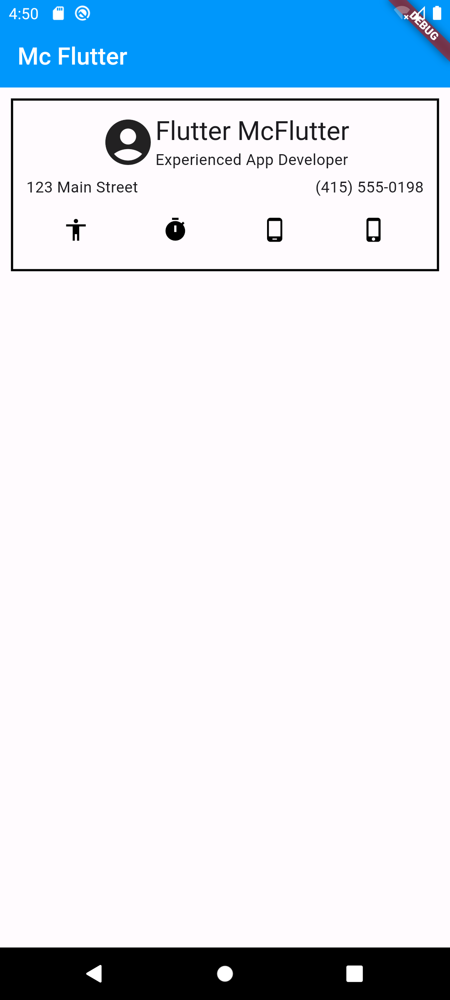
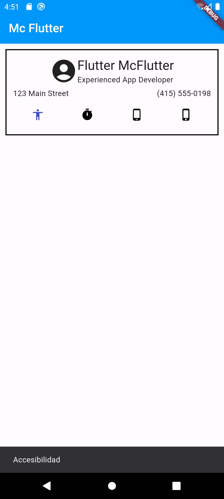

# Mc Flutter
- widgets
- segmentación
- stateful

# Lo que me costo mas trabajo 
- Crear la acción de cambio de color en el icono
- Segmentar las partes de la aplicación

# Lo que aprendi
- Englobar en container para dar un formato
- Diferencia entre StatelessWidget y StatefulWidget
- Crear un SnackBar
- Uso de ScaffoldMessenger
- Usar los estilos de material atraves del contexto

# Screenshots de la app

# Liga Video
[Video](https://drive.google.com/file/d/17uiEQIHfSSJ4W5U8sin-uECCdZ64_OLp/view?usp=drive_link)