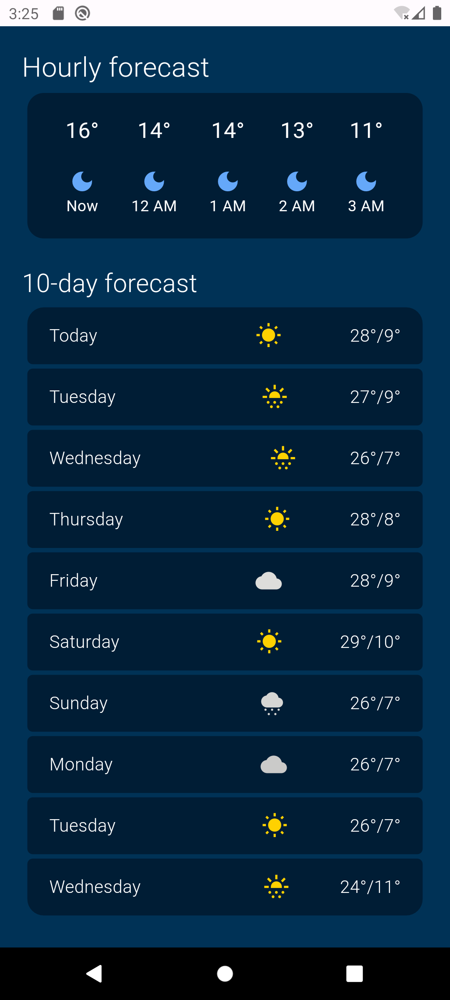
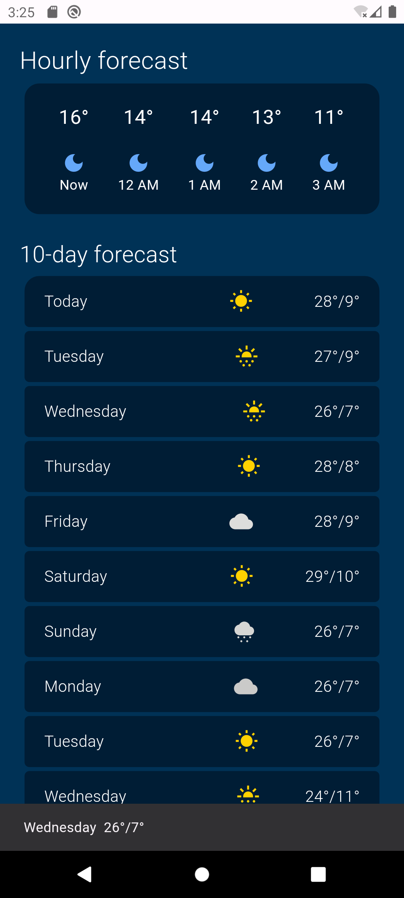

# Hourly forecast
- controlar los snackbars
- manejo de acomodo de widgets
- stateful

# Lo que me costo mas trabajo 
- El acomodo de las filas para que no existiera overflow de pixeles

# Lo que aprendi
- Englobar en container para dar un formato
- Crear un SnackBar
- Uso de ScaffoldMessenger
- Manejar el snackbar para que se quite cuando se vuelva presionar

# Screenshots de la app

# Liga Video
[Video](https://drive.google.com/file/d/1d4_XbsAvguiXYxEKVw7A1yuyyYcGDIzk/view?usp=drive_link)

# Referencias
- P. Lougheed. “Add interactivity to your Flutter app”. Flutter documentation | Flutter. Accedido el 25 de enero de 2024. [En línea]. Disponible: https://docs.flutter.dev/ui/interactivity
- Pierre-Louis. “Icons class - material library - Dart API”. Flutter - Dart API docs. Accedido el 25 de enero de 2024. [En línea]. Disponible: https://api.flutter.dev/flutter/material/Icons-class.html
- G. Spencer. “Container class - widgets library - Dart API”. Flutter - Dart API docs. Accedido el 25 de enero de 2024. [En línea]. Disponible: https://api.flutter.dev/flutter/widgets/Container-class.html
- Muller, H. (2023, 29 de enero). BorderRadius class - painting library - Dart API. Flutter - Dart API docs. https://api.flutter.dev/flutter/painting/BorderRadius-class.html