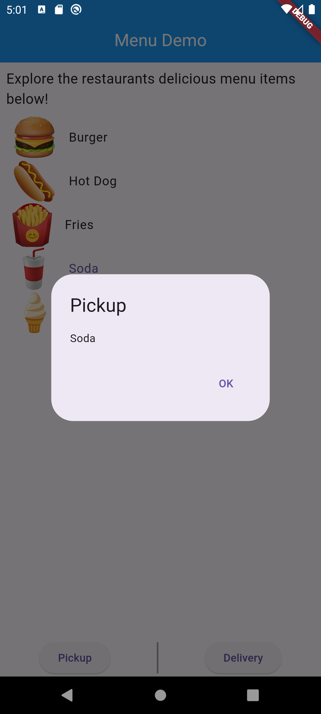

# Menu Demo
- Widget List tile
- Manejo de acomodo de widgets
- Stateful
- VerticalDivider

# Lo que me costo mas trabajo 
- Lograr que el VerticalDivider fuera visible

# Lo que aprendi
- Englobar en container para dar un formato
- Crear un  AlertDialog
- Uso de VerticalDivider
- Manejar el snackbar para que se quite cuando se vuelva presionar

# Screenshots de la app

# Liga Video
[Video](https://drive.google.com/file/d/1fhwZWD10EdqSPhrLLOr7XX_VWrBxYcGp/view?usp=drive_link)

# Referencias
- P. Lougheed. “Add interactivity to your Flutter app”. Flutter documentation | Flutter. Accedido el 25 de enero de 2024. [En línea]. Disponible: https://docs.flutter.dev/ui/interactivity
- Viera, E. (2022, 18 de mayo). Vertical Divider not showing. Stack Overflow. https://stackoverflow.com/questions/59960153/vertical-divider-not-showing
- G. Spencer. “Container class - widgets library - Dart API”. Flutter - Dart API docs. Accedido el 25 de enero de 2024. [En línea]. Disponible: https://api.flutter.dev/flutter/widgets/Container-class.html
