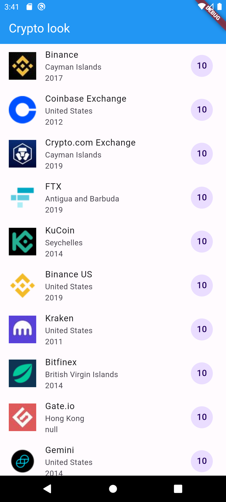
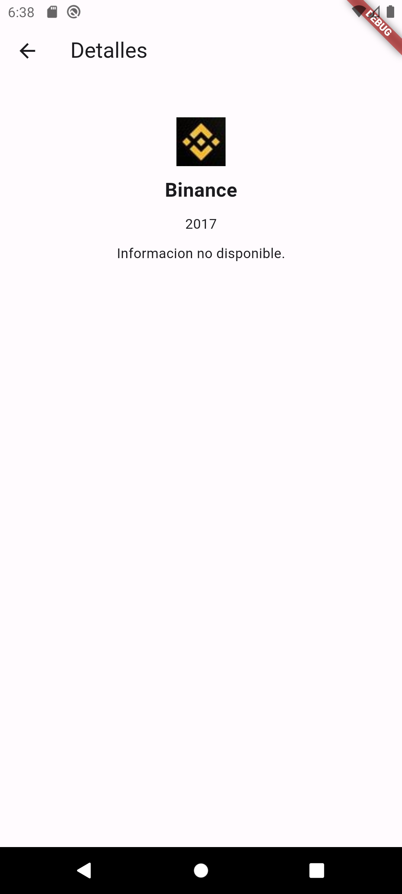

# Menu Demo
- Widget List tile
- Manejo de acomodo de widgets
- Stateful
- Serializar un String
- List de n cantidad de objetos

# Lo que me costo mas trabajo 
- Serializar un String en formato JSON

# Lo que aprendi
- Englobar en container para dar un formato
- Utilizar un List Tile
- Obtener información de constantes 
- Serializar un String en formato JSON

# Screenshots de la app

# Referencias
- Lougheed, P. (2024, 15 de febrero). Use lists. Flutter documentation | Flutter. https://docs.flutter.dev/cookbook/lists/basic-list
- G. Spencer. “Container class - widgets library - Dart API”. Flutter - Dart API docs. Accedido el 25 de enero de 2024. [En línea]. Disponible: https://api.flutter.dev/flutter/widgets/Container-class.html
- Morgan, B. (2023, 19 de noviembre). JSON and serialization. Flutter documentation | Flutter. https://docs.flutter.dev/data-and-backend/serialization/json